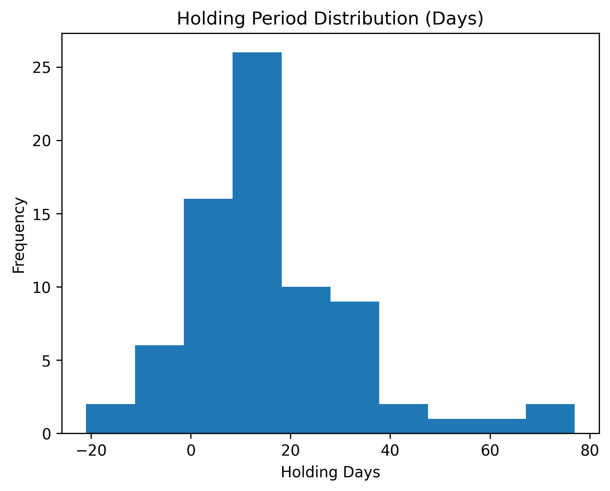

# Evaluating ChatGPT as a Portfolio Decision-Maker in Microcap Equities

*An Exploratory, Forward-Only Paper Trading Study*

## Abstract

### TODO:

## Introduction

### TODO:

## Scope & Contribution

### Scope of Evaluation

ChatGPT functioned as a decision-maker within the experiment. Trading style, risk management, and position sizing were determeined entirely by the model and human input was constrained to manually inputting trades and prompting. The study was strictly confined to stocks in the micro-cap sector with limited starting capital ($100). The experiment timeframe was from June 27th, 2025 to December 26th, 2025. 

### Nature of Contribution 

Forward-only evaluation of ChatGPT's performance and behavior as a portfolio decision-maker within the experimental setup.
The study contributes detailed documentation of decision behavior, execution results, and observed failure modes in the limited information and high volatility of micro-cap equities.

### Non-Claims

The evaluation is not a general test of LLM trading ability. Parameters were not optimized to improve behavior or performance during the experimental period. The setup is not intended as a deployable trading algorithm to generate returns.

## Experimental Setup

### Human Input and Execution

Portfolio and trade log data were updated manually after each NYSE trading day using a standardized processing script, which generated a structured daily input summary (see Appendix [DAILY INPUT]). This summary was provided to the language model as the sole input for decision-making. If trade actions were requested, they were executed on the subsequent trading day. All market data were restricted to only regular trading hours; no pre-market or after-hours data were collected or used.

Human involvement was strictly limited to data entry and trade execution. No discretionary overrides or optimizations were applied to model-generated decisions.

On a limited number of occasions, daily updates could not be performed following market close. In these cases, the missed update was processed using only past data on that market day. To prevent lookahead bias, the model was explicitly constrained to rely solely on the provided input and was prohibited from accessing external or future information.

### Weekly Research Cycle and Execution Exceptions

A weekly research cycle was conducted on Fridays using a dedicated deep research prompt (see Appendix [DEEP RESEARCH PROMPT]) and the "Deep Research" feature was used. When using the "Deep Research" mode, the model will ask clarifing questions. When the model asked for trading guidance, no judgement was given, however questions regarding rules and constriants were always answered accurately. Any trade actions proposed outside this framework on Fridays were deferred pending inclusion in the weekly research output. The resulting report was archived, and all trade actions outlined were executed during the subsequent trading week.

This structure enforced a consistent separation between daily operational updates and higher-level strategic reassessment. Execution remained forward-only.

## Data Description

### Types of Data Collected

This dataset includes overall daily portfolio data for equity and cash, and also includes individual ticker data for each given data. Detailed portfolio CSV columns are provided in Appendix [TRADE LOG CSV DATA]. Trade logs were kept in the event of both buying and selling of securities. See Appendix [TRADE LOG CSV DATA] for detailed schema. Raw analytical reports generated during execution were archived in PDF format. Associated textual summaries were also recorded; however, neither the raw reports nor the summaries were incorporated into the analyses presented in this report.

### Granularity

All benchmark and portfolio data are recorded at daily frequency, with values reflecting end-of-day observations.

### Time Span

The experiment covers the period from June 27, 2025 to December 26, 2025, with all portfolio and benchmark data recorded within this timeframe.

## Methodology

### Research Design

This study employs a forward-looking, rule-based observational design with quasi-experimental controls.

### Decision-Making Framework

The large language model ChatGPT was used as a decision-making engine for the portfolio. The model was tasked with generating daily and weekly trade decisions based exclusively on structured summaries of portfolio state and market data.

No discretionary judgment was applied to model outputs. Human involvement was limited to prompting the model and executing requested trades exactly as the model instructed. The decision process was fully specified in advance and remained constant throughout the study period.

### Microcap Focus

The model was restricted to purchasing equities within the microcapitalization universe (market capitalization ≤ $300 million). This constraint was imposed to evaluate model behavior in securities characterized by limited institutional coverage and reduced analyst attention.

Given these conditions, the model’s reasoning was expected to rely primarily on publicly available disclosures, such as company press releases, and on information typically discussed in retail-focused analyses. This design choice allowed observation of the model’s decision-making processes in environments with sparse formal coverage and higher informational asymmetry.

### Data Sources and Information Constraints

Market data used for portfolio calculations, metrics, and summaries were sourced from Yahoo Finance and restricted to end-of-day observations during regular trading hours. These data were processed into standardized daily input summaries reflecting historical price information, portfolio holdings, and cash balances.

Although the research process permitted consultation of publicly available web sources for contextual analysis, the language model did not have direct access to external websites, raw market data feeds, or real-time information at decision time. Instead, the model operated exclusively on the structured summaries provided as input.

Weekly research reports and output summaries generated during the study were archived for documentation and analysis purposes. These materials were not incorporated into subsequent model inputs and did not influence future decision-making. Textual reports were not analyzed or used for the conclusions stated in this study.

All information supplied to the model was limited to data available as of the close of the relevant trading day. No future market data, post-close information, or subsequent outcomes were included in any model input.

**NOTE: Trade-level statistics were computed at the FIFO lot level, with partial exits treated as independent realized lots rather than as distinct position entries.**

### Bias Mitigation and Validity Controls

Multiple controls were implemented to mitigate common sources of bias in trading studies. To prevent lookahead bias, all model decisions were generated using only information available prior to trade execution, and all trades were executed on a forward-only basis.

Human involvement was strictly limited to data entry and execution of model-generated instructions. No discretionary overrides, trade filtering, or post hoc optimizations were applied at any point during the experimental period.

On occasions when daily data updates could not be performed immediately following market close, missed updates were processed using only information available as of that trading day. The model was explicitly constrained to rely solely on the provided historical inputs, ensuring that delayed data entry did not introduce access to future information.

Although prompt templates evolved over the course of the evaluation, all changes were limited to clarifying existing rules and improving the consistency and precision of report formatting. No changes were made to decision logic, constraints, or trade selection criteria.

## Performance Results

**Figure 1.** Portfolio equity versus benchmark (normalized to $100) over time.

As shown in Figure 1, portfolio equity declined substantially relative to both the Russell 2000 and the S&P 500 over the experimental period.

**Figure 2.** Portfolio equity with max drawdown percentage (red) and largest run (green).

Figure 2 highlights the largest positive equity movement and the maximum drawdown observed during the experimental period. The largest run occurred between November 13, 2025 and November 18, 2025, during which portfolio equity increased by 21.51%. The maximum drawdown reached −50.33%, corresponding to an equity value of $67.10 on November 6, 2025.

## Trade-Level Analysis

Using FIFO lot-level reconstruction, 46 realized lot exits were observed. Exactly 50% of lot exits were profitable; however, average losses exceeded average gains (−3.83 vs +3.01), producing a profit factor of 0.82 and a negative per-lot expectancy of −0.41. Median outcomes showed the opposite pattern, indicating that overall underperformance was driven by a small number of large losses rather than uniformly poor trade selection.

Full Individual Trade Table found in Appendix[Individual Trade Table]

## Concentration and Risk Analysis

**Figure 3.** Realized PnL (USD) by ticker.

Figure 3 shows 10 of the 22 tickers the model bought within the experimental period generated profits.
Profits among tickers generally had concentrated profits; with the exception of ATYR,
losses were less concentrated. 

**Figure 4.** Top realized PnL (USD) ticker wins vs. losses.

As shown in Figure 4, realized losses were larger in magnitude than realized gains. The most significant downside outcome was attributable to ATYR, indicating that overall portfolio performance was strongly influenced by a small number of adverse position-level outcomes.

Taken together, these distributions indicate a highly concentrated return profile in which aggregate portfolio performance was driven by a limited number of large-magnitude position outcomes rather than by broadly distributed incremental gains. Downside risk was similarly concentrated, with a small subset of positions accounting for a disproportionate share of total losses. As a result, overall performance was highly sensitive to individual ticker-level outcomes. On average, the portfolio consisted of 3.1 tickers on a given trading day.

Summary statistics reported in this section are derived from the position-level (“Pure PnL”) tables provided in Appendix [Pure PnL Tables].

Although trade execution occurred at the FIFO lot level, aggregation of realized outcomes at the position level reveals that only 10 of 22 tickers generated positive total PnL. Average losses exceeded average gains in magnitude, and the largest single position loss dominated overall results, consistent with exposure to binary, event-driven return dynamics.

The distribution of FIFO lot-level outcomes (reported elsewhere) aligns with the concentration patterns observed at the ticker level, indicating that portfolio-level concentration emerged from a small number of large-magnitude realized exits rather than from uniformly poor trade execution.

## Behavioral Analysis

**Figure 6.** Distribution of holding periods across individual closed lots.

Figure 6 shows a strongly right-skewed distribution with a long right tail. The majority of FIFO lot exits occurred within approximately 10–20 trading days, while a small number of lots were held for substantially longer durations, including one holding period exceeding 70 days.

**Figure 7.** Total individual ticker holding duration during trading days.

Figure 7 shows that cumulative holding time was concentrated in a small number of tickers, with ABEO and MIST accounting for the largest total time-in-portfolio exposure. Despite their extended holding durations, these positions produced divergent realized outcomes: ABEO ranked fifth in total realized PnL, while MIST ranked eighth from the bottom. This contrast indicates that prolonged holding time alone was not a reliable determinant of portfolio-level performance.

Instead, individual ticker outcomes were more impactful for overall performance than holding duration.

**Figure 8.** Number of repeated buy-side trade entries per ticker.

Seven of the 22 tickers were purchased on multiple occasions. Notably, the three tickers with the lowest realized PnL (see Figure 4) were all subject to repeated buy-side entries. In contrast, the three highest-PnL tickers were each purchased only once during the experimental period.

This pattern suggests persistence in position-level theses, with the model exhibiting limited responsiveness to realized performance when determining whether to re-enter previously traded securities.

## Operational Constraints

### Human Input Required
Human input was needed in the execution loop for inputting trades and prompting for each trading day. 

### Micro-Cap Stocks Only
The model was only allowed to buy tickers with market capitalizations equal to or less 300M. If a held ticker's capitalization became greater than 300M, the model could not buy any more shares.

### Close Data Only
All data was calculated based of end-of-day trading data only.

### Financial Derivatives Prohibited

Financial derivatives were strictly not allowed.

## Failure Modes

### Over Concentration

Throughout the experiment, the portfolio routinely consisted of 2-3 concentrated tickers. The overall portfolio was particularly sensitive to individual ticker factors.

### Buying Past Losing Stocks

As shown in Figure 4 and Figure 6, FBIO and IINN were among the largest contributors to realized losses. Both tickers had relatively high trade frequencies, with FBIO having four buy-side trades and IINN receiving three.

### Reliance on Bianry Outcomes

Trade selection was characterized by exposure to event-driven catalysts (e.g., regulatory announcements), associated with large positive or negative outcomes. Comparatively limited exposure was observed in lower-volatility or incremental-return investing.

## Discussion

### TODO:

## Limitations

### Short Timeframe

Due to the limited experimental period, the data may not be representative of the model's behavior across different market regimes.

### Market Captialization

The evalution should only be analyzed in the context of micro-cap equities; LLM behavior may vary widely in different market capitlizations. 

### Single-Run Evaluation

The evaluation is based on a single experimental run and does not capture variability across repeated runs or alternative random intial conditions.

### Generalizations

The evaluation or its conclusions should not be generalized to LLM trading as a whole. This conclusions of evauluation should be interpreted with the stated constraints and limitations in mind.

### Prompt and Model Variability

The experimental setup relied on interactive use of the publicly available ChatGPT interface, introducing sources of variability that could not be fully controlled. Prompt templates evolved modestly to clarify existing constraints, newer model versions were adopted as they became available, and generation parameters such as temperature were not explicitly fixed. 

The evaluation focuses on observable decision behaviors under consistent informational and procedural constraints rather than on comparisons across specific model configurations.

## Conclusion

Across the experimental period, portfolio equity outcomes were dominated by a small number of high-impact trades. High position concentration amplified exposure to individual ticker outcomes, with the ATYR position exerting a disproportionate influence on overall portfolio balance. Trading behavior exhibited persistence in position-level theses, as the model re-entered tickers despite prior exits, including cases with realized losses. Tickers subject to repeated buy-side entries accounted for the largest cumulative equity losses. In addition, the model held several positions for extended durations despite ultimately contributing minimally to overall portfolio performance, indicating that holding period length alone was not a reliable determinant of realized outcomes.

Rather than evaluating predictive skill or performance optimization, these findings characterize how an LLM would allocate funds, manage exposure, and react to market volatility under conditions of limited capital and elevated risks of micro-cap trading.

## Future Work

### TODO:

## Appendix A. Metric Definitions and Formulas

## Appendix B. Representative LLM Outputs

## Appendix C. Prompt Templates and Versions

## Appendix D. Additional Tables and Figures
