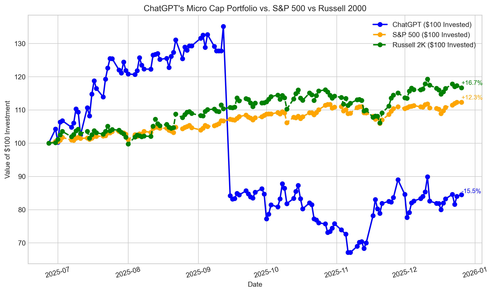
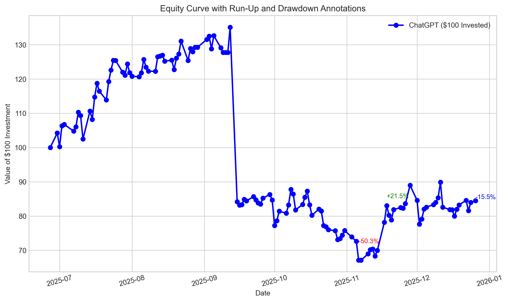
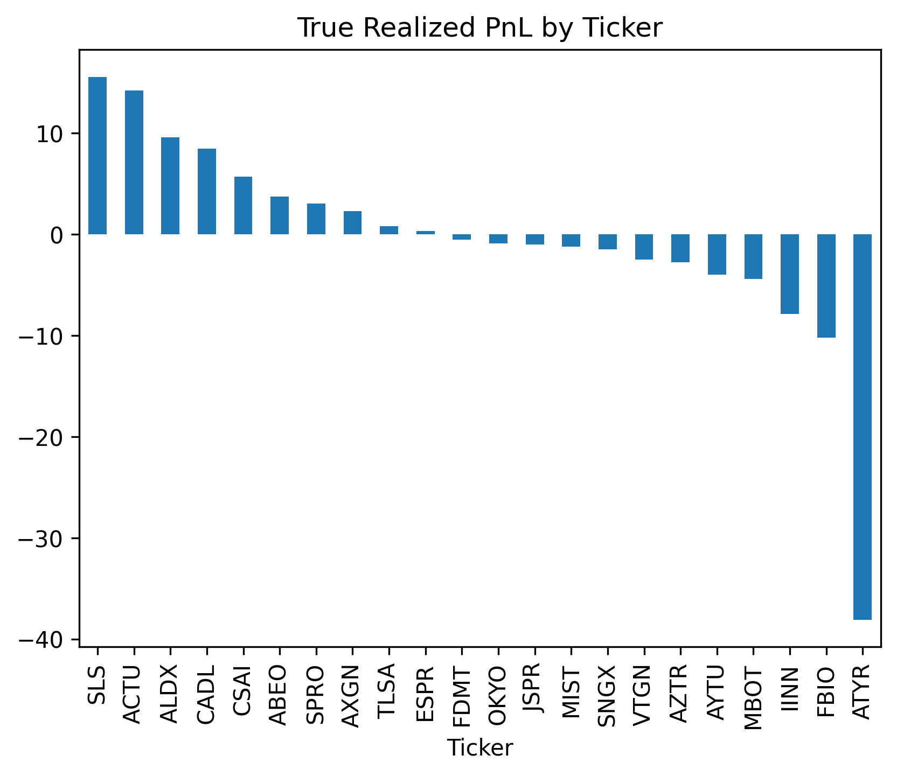
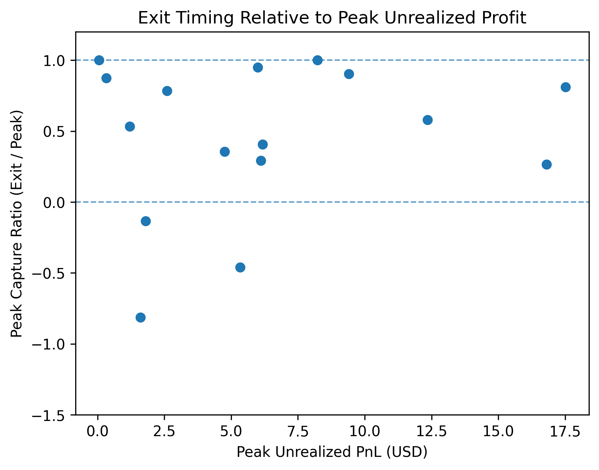
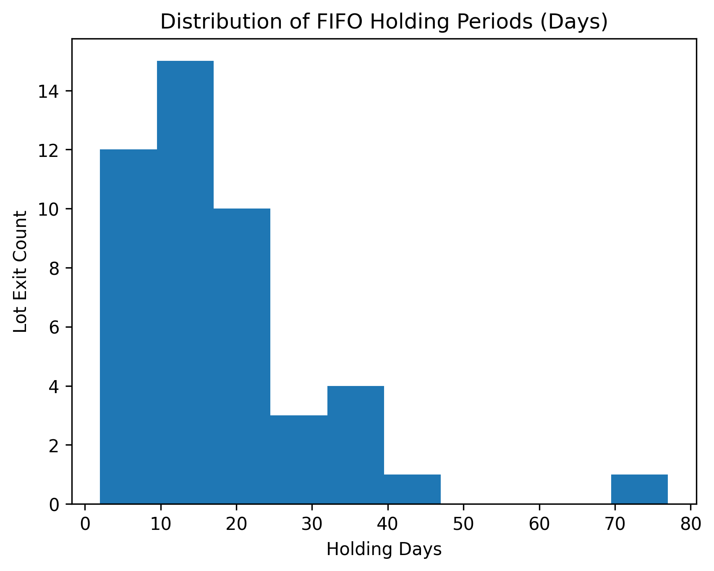
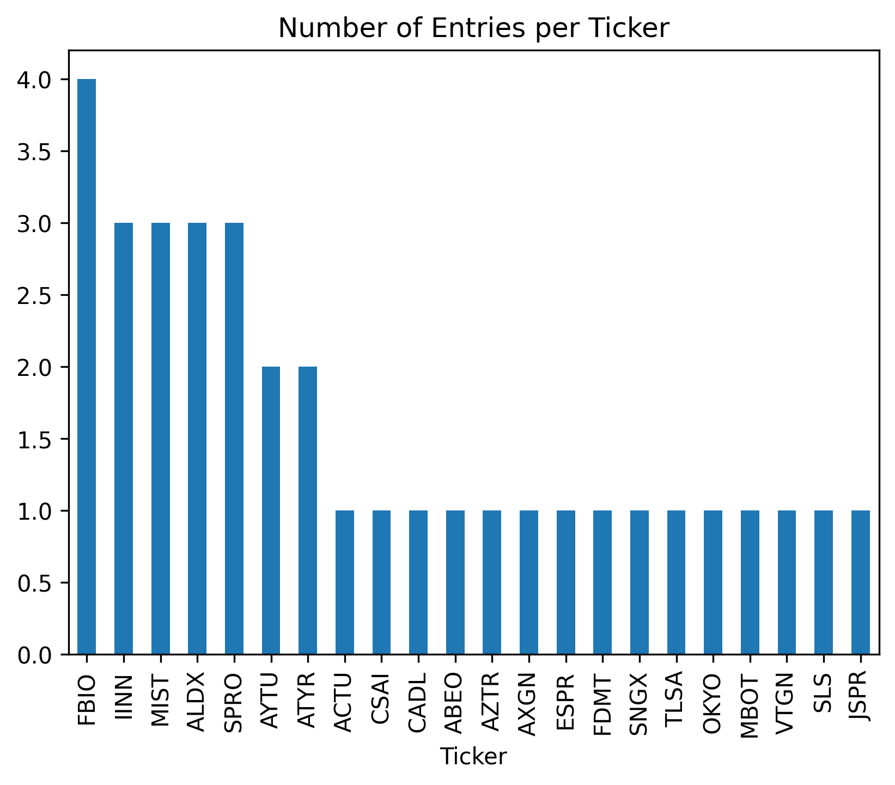

## Abstract

Large language models (LLMs) are increasingly being applied to financial tasks; however, systematic research on LLMs acting as autonomous decision-making agents remains limited. This evaluation presents a paper-trading study of ChatGPT acting as a portfolio decision-maker within the U.S. listed micro-cap equity market.

Over the six-month experimental period, the model was prompted using daily trading updates and weekly portfolio evaluations. ChatGPT had complete control over portfolio decisions, while human input was strictly limited to prompting and trade execution.

The evaluation found that portfolio outcomes were heavily influenced by a small number of concentrated positions. Model behavior was characterized by high portfolio concentration, persistence in ticker-level theses, and asymmetric downside exposure. The model frequently re-entered tickers with prior realized losses and relied on event-driven outcomes, contributing disproportionately to overall portfolio drawdowns.

Rather than optimizing performance or assessing predictive skill, this evaluation examines how an LLM allocates capital, manages risk, and exhibits trading behavior under conditions of limited capital and elevated risk within the micro-cap equity universe,
providing insight into structural decision-making tendencies relevant to future LLM-based financial systems.

---

## Introduction

While machine learning has been utilized in finance for decades, systematic research into the behavior of LLMs as autonomous decision-makers in financial contexts remains in its early stages.

Finance serves as a valuable frontier for LLM research due to the complexity and constant evolution of equity markets. In these environments, LLMs can quantitatively evaluate many factors that affect decision-making and behavior under uncertainty.

This evaluation focuses on U.S. listed micro-cap equities. Micro-cap stocks are characterized by higher volatility, lower liquidity, and limited analyst coverage, resulting in greater informational asymmetry. Trading in this environment provides a setting in which information processing, narrative interpretation, and risk management decisions have amplified consequences.

By constraining ChatGPT to operate exclusively within this environment, this evaluation seeks to observe how an LLM behaves when informational efficiency is weaker and downside risk is elevated. Rather than prioritizing performance or optimization, this evaluation seeks to identify decision-making behavior, portfolio construction tendencies, and observed failure modes under conditions of limited capital and heightened risk.

This study seeks to answer: "When ChatGPT is placed in a forward-only trading environment as a portfolio-managing agent given limited starting capital, what behavior patterns emerge?"

---

## Contribution & Scope

### Scope of Evaluation

ChatGPT functioned as a decision-maker within the experiment. Trading style, risk management, and position sizing were determined entirely by the model and human input was constrained to manually inputting trades and prompting. The study was strictly confined to stocks in the micro-cap sector in U.S. listed exhanges with limited starting capital ($100). The experiment timeframe was approximately 6 calendar months.

### Nature of Contribution

Forward-only evaluation of ChatGPT's performance and behavior as a portfolio decision-maker within the experimental setup.
The study contributes detailed documentation of decision behavior, execution results, and observed failure modes in the limited information and high volatility of micro-cap equities. The study documents decision behavior within a fixed experimental setup and is not intended as a general assessment of LLM trading ability or as a deployable trading system.

---

## Experimental Setup

### Human Input and Execution

Portfolio and trade log data were updated manually after each NYSE trading day using a standardized processing script, which generated a structured daily input summary (see Appendix C.3). This summary was provided to the language model as the sole input for decision-making. If trade actions were requested, they were executed on the subsequent trading day. All market data were restricted to only regular trading hours; no pre-market or after-hours data were collected or used.

Human involvement was strictly limited to data entry and trade execution. No discretionary overrides or optimizations were applied to model-generated decisions.

On a limited number of occasions, daily updates could not be performed following market close. In these cases, the missed update was processed using only past data on that market day. The model was explicitly constrained to rely solely on the provided input and was prohibited from accessing external or future information.

### Weekly Research Cycle and Execution Exceptions

A weekly research cycle was conducted on Fridays using a dedicated deep research prompt (see Appendix C.2) and the "Deep Research" feature was used. When using the "Deep Research" mode, the model will ask clarifying questions. When the model asked for trading guidance, no judgement was given, however questions regarding rules and constraints were always answered accurately. Any trade actions proposed outside this framework on Fridays were deferred pending inclusion in the weekly research output. The resulting report was archived, and all trade actions outlined were executed during the subsequent trading week.

---

## Data Description

### Types of Data Collected

This dataset includes overall daily portfolio data for equity and cash, and also includes individual ticker data for each given data. Trade logs were kept in the event of both buying and selling of securities. See Appendix A.0.2 for detailed schema for both CSV files. Raw analytical reports generated during execution were archived in PDF format. Associated textual summaries were also recorded; however, neither the raw reports nor the summaries were incorporated into the analyses presented in this report.

### Granularity

All benchmark and portfolio data are recorded at daily frequency, with values reflecting end-of-day observations.

### Time Span

The experiment covers the period from June 27, 2025 to December 26, 2025, with all portfolio and benchmark data recorded within this timeframe.

### Figure Data Sources

- (Figure 1–2) Equity series + equity-curve metrics (MDD, largest run) → Appendix A.1

- (Figure 6) Holding-period distribution of FIFO lot exits → Appendix A.2 and Appendix D.2

- (Figures 3–4) Position-level (“Pure PnL”) results → Appendix A.3 and Appendix D.3–D.4

- (Figure 5) Episode metrics + PCR → Appendix A.13–A.15 and Appendix D.7

- (Figure 7) Total logged holding days by ticker (count of unique trading dates with Shares > 0 from Daily Updates.csv)
  → Appendix A.16 (Total Logged Holding Days by Ticker definition)
  → Appendix D.9 (Total Logged Holding Days by Ticker table)

- (Figure 8) Repeated buy-side exposure per ticker (count of buy transactions per ticker from Trade Log.csv, plotted as Buy_Entries - 1)
  → Appendix A.17 (Buy-Side Entries and Re-Entries definition)
  → Appendix D.10 (Buy Entries and Re-Entries by Ticker table)

---

## Methodology

### Research Design

This study employs a forward-looking, rule-based observational design with quasi-experimental controls.

### Decision-Making Framework

The large language model ChatGPT was used as a decision-making engine for the portfolio. The model was tasked with generating daily and weekly trade decisions based exclusively on structured summaries of portfolio state and market data.

### Micro-Cap Focus

The model was restricted to purchasing equities within the microcapitalization universe (market capitalization <= $300 million) on U.S listed stock exchanges. This constraint was imposed to evaluate model behavior in securities characterized by limited institutional coverage and reduced analyst attention.

Given these conditions, the model’s reasoning was expected to rely primarily on publicly available disclosures, such as company press releases, and on information typically discussed in retail-focused analyses. This design choice allowed observation of the model’s decision-making processes in environments with sparse formal coverage and higher informational asymmetry.

### Data Sources and Information Constraints

Market data used for portfolio calculations, metrics, and summaries were sourced from the Python library "yfinance" and restricted to end-of-day observations during regular trading hours. These data were processed into standardized daily input summaries reflecting historical price information, portfolio holdings, and cash balances.

Although the research process permitted consultation of publicly available web sources for contextual analysis, the language model did not have direct access to external websites, raw market data feeds, or real-time information at decision time. Instead, the model operated exclusively on the structured summaries provided as input.

Weekly research reports and output summaries generated during the study were archived for documentation and analysis purposes. These materials were not incorporated into subsequent model inputs and did not influence future decision-making. Textual reports were not analyzed or used for the conclusions stated in this study.

All information supplied to the model was limited to data available as of the close of the relevant trading day. No future market data, post-close information, or subsequent outcomes were included in any model input.

**NOTE: Trade-level statistics were computed at the FIFO lot level, with partial exits treated as independent realized lots rather than as distinct position entries.**

### Bias Mitigation and Validity Controls

Multiple controls were implemented to mitigate common sources of bias in trading studies. To prevent lookahead bias, all model decisions were generated using only information available prior to trade execution, and all trades were executed on a forward-only basis.

Human involvement was strictly limited to data entry and execution of model-generated instructions. No discretionary overrides, trade filtering, or post hoc optimizations were applied at any point during the experimental period.

On occasions when daily data updates could not be performed immediately following market close, missed updates were processed using only information available as of that trading day. The model was explicitly constrained to rely solely on the provided historical inputs, ensuring that delayed data entry did not introduce access to future information.

Although prompt templates evolved over the course of the evaluation, all changes were limited to clarifying existing rules and improving the consistency and precision of report formatting. No changes were made to decision logic, constraints, or trade selection criteria.

---

## Performance Results


**Figure 1.** Portfolio equity versus benchmarks (normalized to $100) over time.

Benchmarks such as the Russell 2000 and the S&P 500 were included to provide contextual reference for broad market conditions during the experimental period rather than to evaluate relative performance. The benchmarks serve to anchor the observed equity trajectory within market regimes; however, all conclusions in this evaluation are derived from portfolio behavior, decision patterns, and realized outcomes, and are not contingent on benchmark performance comparisons.

As shown in Figure 1, portfolio equity declined substantially relative to both the Russell 2000 and the S&P 500 over the experimental period.


**Figure 2.** Portfolio equity with max drawdown percentage (red) and largest run (green).

Figure 2 highlights the largest positive equity movement and the maximum drawdown observed during the experimental period. The largest run occurred between November 13, 2025 and November 18, 2025, during which portfolio equity increased by 21.51%. The maximum drawdown reached -50.33%, corresponding to an equity value of $67.10 on November 6, 2025.

---

## Trade-Level Analysis

Using FIFO lot-level reconstruction, 46 realized lot exits were observed. Exactly 50% of lot exits were profitable; however, average losses exceeded average gains (-3.83 vs +3.01), producing a profit factor of 0.82 and a negative per-lot expectancy of -0.41. Median outcomes showed the opposite pattern, indicating that overall underperformance was driven by a small number of large losses rather than uniformly poor trade selection.

Full Individual Trade Table found in Appendix D.2.

---

## Concentration and Risk Analysis


**Figure 3.** Realized PnL (USD) by ticker.

Figure 3 shows 10 of the 22 tickers the model bought within the experimental period generated profits.
Profits among tickers generally had concentrated profits; with the exception of ATYR,
losses were less concentrated.


**Figure 4.** Top realized PnL (USD) ticker wins vs. losses.

As shown in Figure 4, realized losses were larger in magnitude than realized gains. The most significant downside outcome was attributable to ATYR, indicating that overall portfolio performance was strongly influenced by a small number of adverse position-level outcomes.

On average, the portfolio held 3.1 tickers per trading day, indicating a high degree of concentration throughout the experimental period (Appendix D.8).


**Figure 5.** Peak Capture Ratio (exit PnL divided by peak unrealized PnL) plotted against peak unrealized profit for valid trade episodes.

Four episodes had null Peak Capture Ratios due to the peak recorded PnL value being below zero. These tickers were left out of the graph.

Two other trade episodes were also excluded due to methodological reasons. The ATYR episode produced a valid capture ratio; however, realized outcomes were materially affected by execution constraints following a large overnight price gap, requiring a manual exit at the opening price and preventing normal stop-loss execution. As a result, the observed ratio reflects execution limitations rather than exit timing behavior. The FBIO episode, by contrast, represents a structural outlier in which a small unrealized peak preceded a large realized loss, producing an extreme negative capture ratio driven by denominator instability. FBIO is therefore excluded for interpretability.

The definition of a trade episode is provided in Appendix A.13. The complete trade-episode table is available in Appendix D.7.

Figure 5 indicates that, for the remaining episodes, exits often captured a meaningful fraction of peak unrealized PnL. Peak Capture Ratios varied substantially across episodes, with no clear relationship between peak PnL magnitude and exit timing behavior.

Although trade execution occurred at the FIFO lot level, aggregation of realized outcomes at the position level reveals that only 10 of 22 tickers generated positive total PnL. Average losses exceeded average gains in magnitude, and the largest single position loss dominated overall results, consistent with exposure to binary, event-driven return dynamics.

The distribution of FIFO lot-level outcomes (reported in Trade-Level Analysis) aligns with the concentration patterns observed at the ticker level, indicating that portfolio-level concentration emerged from a small number of large-magnitude realized exits rather than from uniformly poor trade execution.

---

## Behavioral Analysis


**Figure 6.** Distribution of holding periods across individual closed lots.

Figure 6 shows a strongly right-skewed distribution with a long right tail. The majority of FIFO lot exits occurred within approximately 10–20 days, while a small number of lots were held for substantially longer durations, including one holding period exceeding 70 days calendar days.


**Figure 7.** Total individual ticker holding duration during trading days.

Figure 7 shows that cumulative holding time was concentrated in a small number of tickers, with ABEO and MIST accounting for the largest total time-in-portfolio exposure. Despite their extended holding durations, these positions produced divergent realized outcomes: ABEO ranked fifth in total realized PnL, while MIST ranked eighth from the bottom. This contrast indicates that prolonged holding time alone was not a reliable determinant of portfolio-level performance.

**Note: Figure 6 reports FIFO lot holding durations in calendar days to capture individual lot persistence, while Figure 7 measures cumulative holding time in trading days to reflect overall market exposure.**

Instead, individual ticker outcomes were more impactful for overall performance than holding duration.


**Figure 8.** Number of repeated buy-side trade entries per ticker.

Seven of the 22 tickers were purchased on multiple occasions. Notably, the three tickers with the lowest realized PnL (see Figure 4) were all subject to repeated buy-side entries. In contrast, of the top three highest PnL tickers in Figure 3, only ALDX was repurchased more than once.

This pattern suggests persistence in position-level theses, with the model exhibiting limited responsiveness to realized performance when determining whether to re-enter previously traded securities.

---

## Operational Constraints

### Human Input Required

Human input was needed in the execution loop for inputting trades and prompting for each trading day.

### Micro-Cap Stocks Only

The model was only allowed to buy U.S. listed tickers with market capitalizations equal to or less than 300M. If a held ticker's capitalization became greater than 300M, the model could not buy any more shares.

### Close Data Calculations

All data was calculated based on end-of-day trading data only.

### Simulation Limitations

The trading simulation did not incorporate transaction costs such as commissions or bid–ask spread effects.


### Financial Derivatives Prohibited

Financial derivatives were strictly not allowed.

---

## Failure Modes

### Over Concentration

Throughout the experiment, the portfolio routinely consisted of 2-3 concentrated tickers. The overall portfolio was particularly sensitive to individual ticker factors.

### Buying Past Losing Stocks

As shown in Figure 4 and Figure 7, FBIO and IINN were among the largest contributors to realized losses. Both tickers had relatively high trade frequencies, with FBIO having four buy-side trades and IINN receiving three.

### Reliance on Binary Outcomes

Trade selection was characterized by exposure to event-driven catalysts (e.g., regulatory announcements), associated with large positive or negative outcomes. Comparatively limited exposure was observed in lower-volatility or incremental-return investing.

---

## Discussion

### Portfolio Concentration

Throughout the experiment, the model's portfolio consisted of three tickers for trading days on average. The average cost basis for a ticker position was $25.28 (25% of starting capital). This indicates the model preferred high concentration positions with limited portfolio diversity. This allocation pattern reflects a preference for highly concentrated positions and limited diversification, resulting in substantial exposure to individual ticker-level movements.  

### Risk and Loss Asymmetry

The model’s performance was characterized by pronounced loss asymmetry. As shown in Figure 2, the portfolio reached a maximum drawdown of approximately 50% over the experimental period. The largest losing ticker (ATYR) generated losses more than double the gains produced by the largest winning ticker (SLS). On the day of ATYR’s sharp decline, the portfolio experienced an approximately 40% single-day equity drop. Loss asymmetry was driven primarily by this single event, as other losing positions were comparatively small and did not materially affect portfolio-level outcomes.

### Position Persistence and Re-Entry

According to Figure 8, the model bought approximately 32% of tickers entered during the experimental period more than once (7 of 22). As shown in Figure 3, five of these repeatedly traded tickers generated negative cumulative realized PnL across all engagements. In contrast, the two of the highest-PnL tickers in Figure 3 were each purchased only once, with the exception of ALDX, during the experimental period. This pattern indicates persistence in position-level exposure, with re-entry occurring despite unfavorable prior outcomes rather than avoidance following realized losses.

### Holding Duration and Outcomes

Figure 6 shows the majority of exits occurred within approximately 10–20 calendar days, while a small number of lots were held for substantially longer durations, including one holding period exceeding 70 total days. Holding duration, however, did not correlate with substantially higher or lower realized PnL. As shown in Figure 7, the two tickers with the highest cumulative holding time, MIST and ABEO, did not rank among the top or bottom three tickers by total realized PnL in Figure 4.

### Observational Analysis

These observations are purely qualitative and are not analyzed quantitatively in the evaluation due to limitations of collected data and research scope.

During execution, stop-loss levels were often adjusted upward prior to anticipated catalyst events. However, large adverse price moves occurred outside regular trading hours, rendering these stop-loss levels ineffective. The model appeared to persist in this behavior even after the substantial equity loss associated with the ATYR outcome.

The model would occasionally hallucinate portfolio details or explicitly state rationale that was not grounded in the experimental setup during Deep Research reports. For example, in one weekly report the model referenced the absence of using hedging instruments, despite the use of derivatives and short positions being clearly prohibited throughout the experiment. This specific inconsistency reflects narrative generation rather than a change in execution logic. A representative excerpt is provided in Appendix B.

---

## Limitations

Due to the limited experimental period, the data may not be representative of the model's behavior across different market regimes.
The evaluation should only be analyzed in the context of micro-cap equities; LLM behavior may vary widely in different market capitalizations.
The results analyzed are based on a single experimental run and does not capture variability across repeated runs or alternative random initial conditions. This study is descriptive in nature, documenting observed decision-making behavior when an LLM is placed in a constrained capital allocation role.

### Prompt and Model Variability

The experimental setup relied on interactive use of the publicly available ChatGPT interface, introducing sources of variability that could not be fully controlled. Prompt templates evolved modestly to clarify existing constraints, newer model versions were adopted as they became available, and generation parameters such as temperature were not explicitly fixed.

The evaluation focuses on observable decision behaviors under consistent informational and procedural constraints rather than on comparisons across specific model configurations.

---

## Conclusion

Across the experimental period, portfolio equity outcomes were dominated by a small number of high-impact trades. High position concentration amplified exposure to individual ticker outcomes, with a single adverse position exerting a disproportionate influence on overall portfolio balance. Trading behavior exhibited persistence in position-level theses, as the model re-entered tickers despite prior exits, including cases with realized losses. Tickers subject to repeated buy-side entries accounted for the largest cumulative equity losses. In addition, the model held several positions for extended durations despite ultimately contributing minimally to overall portfolio performance, indicating that holding period length alone was not a reliable determinant of realized outcomes. Exit outcomes frequently occurred after a substantial portion of unrealized gains had accrued, though full capture of peak PnL was uncommon.

Taken together, these results suggest that, when placed in a capital allocation role, an LLM exhibits decision-making patterns resembling high-conviction, thesis-driven discretionary trading. Portfolio outcomes were shaped less by incremental trade-level performance and more by concentration, persistence in position-level narratives, and asymmetric downside exposure.

---

## Future Research

### Controlling Stochastic Variation in Model Outputs

Future evaluations could reduce uncontrolled variability by replacing interactive human prompting with algorithmic prompting and fixed generation parameters.
Programmatic control over sampling settings, such as temperature, would allow differences in experimental outcomes to be attributed to stochastic variation  rather than procedural differences. This modification would support more rigorous comparison across runs and across models, while preserving the forward-only execution constraints of the study.

### Comparison Across Sectors

Future comparisons across sectors in the stock market could reveal model patterns given different environments. Factors such as risk management, report confidence, and behavioral changes following market events could be used to evaluate how decision-making differs across market scenarios.

### Decision-Making Differences Across Models

Future work could examine differences in decision-making behavior across large language models under identical experimental conditions. Comparing model behavior could highlight differences in risk management, concentration, persistence, and responses to realized outcomes when acting as portfolio decision-makers.

### Capital Scale and Risk Management Behavior

Evaluations conducted under identical constraints, with the exception of increased starting capital, would likely produce different risk management behaviors. Future work could analyze how starting capital influences position sizing, diversification, and overall portfolio performance.

### Post Hoc Sentiment Analysis of Generated Reports

By analyzing the collected reports over the course of the experiment, future work could examine the relationship between expressed sentiment and realized portfolio performance over time. This analysis could also investigate divergences between generated report language and observed model behavior, including cases where narrative confidence did not align with portfolio actions that followed. In addition, the frequency and nature of model hallucinations, such as false rule assumptions or incorrect portfolio state descriptions, could be systematically documented and analyzed.

---

## Appendix A. Metric Definitions and Formulas

### A.0 Data Provenance and Reconstruction Notes

#### A.0.1 Blended Data Collection

Portfolio monitoring and recordkeeping in this study used a blended data collection process. Two primary artifacts were maintained:

- `Trade Log.csv`, containing discrete buy and sell events including dates, shares, prices, and cost basis fields
- `Daily Updates.csv`, containing end-of-day position snapshots including shares held and per-day PnL fields by ticker

These sources were produced through an operational workflow combining manual updates and a standardized processing script. They were not generated as a single unified, transaction-perfect ledger. As a result, the analyses in this appendix should be interpreted as reconstructions derived from blended records rather than as broker-grade, audit-ready accounting statements.

#### A.0.2 Source File Schemas

The analyses in this report rely on the following source-file column schemas.

Daily Updates.csv columns:

- Date
- Ticker
- Shares
- Buy Price
- Cost Basis
- Stop Loss
- Current Price
- Total Value
- PnL
- Action
- Cash Balance
- Total Equity

Trade Log.csv columns:

- Date
- Ticker
- Shares Bought
- Buy Price
- Cost Basis
- PnL
- Reason
- Shares Sold
- Sell Price

#### A.0.3 Reconstruction Strategy vs Ground Truth

Metrics in Appendix A are computed using reconstruction strategies designed to produce consistent, interpretable summaries of behavior:

- FIFO lot-level realized exits are reconstructed from `Trade Log.csv` by matching sell transactions to prior buy transactions under a first-in, first-out convention
- Position-level (Pure PnL) statistics are reconstructed by aggregating reconstructed FIFO lot exits to one row per ticker
- Episode-level statistics (including Peak Capture Ratio) are reconstructed from `Daily Updates.csv` by identifying continuous holding intervals from the `Shares` field and summarizing the recorded daily `PnL` series
- Equity-curve statistics (including Maximum Drawdown and Largest Run) are reconstructed from `Daily Updates.csv` using rows where `Ticker == "TOTAL"` and the `Total Equity` field, with a baseline row inserted

These reconstructions approximate realized and unrealized dynamics for analytical purposes. They are not intended to be treated as definitive accounting of tax lots, brokerage fills, corporate actions, intraday execution effects, or all sources of slippage.

#### A.0.4 Interpretation Guidance

Because the underlying dataset is blended and reconstructed, the metrics are intended to support behavioral characterization (for example: concentration, persistence, re-entry frequency, and exit timing tendencies) rather than precise performance attribution.

Where reconstruction choices matter, this appendix defines the conventions explicitly (FIFO lot matching, calendar-day holding duration, episode segmentation, and equity-curve segmentation) so that results can be reproduced under the same assumptions.

### A.1 Equity Curve Metrics (Maximum Drawdown and Largest Run)

#### A.1.1 Portfolio Equity Series Used

Maximum drawdown and largest run calculations are computed from the portfolio equity time series constructed as follows:

- Filter `Daily Updates.csv` to rows where `Ticker == "TOTAL"`
- Parse `Date` as a datetime
- Coerce `Total Equity` to numeric
- Prepend a baseline row:
  - Date = 2025-06-27
  - Total Equity = 100.0
- Concatenate, sort by Date, and drop duplicate Dates keeping the last record for each Date

This produces a single Date-sorted equity series used for all equity-curve metrics.

#### A.1.2 Running Maximum

The running maximum at time t is defined as the maximum observed portfolio equity from the start of the series through time t.

In code, this is computed as:

- Running Max = cumulative maximum of `Total Equity`

#### A.1.3 Drawdown Percentage

Drawdown percentage at time t is computed as:

- Drawdown % = (`Total Equity` / `Running Max` - 1.0) × 100.0

This produces values of 0.0 at new equity highs and negative values when equity is below the prior peak.

#### A.1.4 Maximum Drawdown

Maximum drawdown is the most negative drawdown percentage observed across the full series.

In code, the maximum drawdown point is selected by:
- finding the row with the minimum value of `Drawdown %`

Reported maximum drawdown fields:
- max_drawdown_date: Date of the minimum `Drawdown %` row
- max_drawdown_equity: `Total Equity` on that Date
- max_drawdown_pct: `Drawdown %` on that Date

#### A.1.5 Largest Run (Run-Up from Local Minimum to Subsequent Peak)

Largest Run is defined as the largest percentage increase from a local minimum to a subsequent peak, using the segmentation logic in `find_largest_gain(...)`.

Algorithm summary:
- Initialize the first observation as the current local minimum and current peak
- If a new higher equity value occurs, update the current peak
- If a decline occurs (current equity < current peak), compute the completed run gain:
  - gain = (peak_val - min_val) / min_val × 100.0
  - update the best run if this gain exceeds the prior best
  - reset local minimum and peak to the current observation
- After reaching the end of the series, also evaluate the final run segment

Reported largest run fields:
- largest_run_start: Date of the local minimum for the best run
- largest_run_end: Date of the subsequent peak for the best run
- largest_run_gain_pct: percent gain for the best run

Interpretation note:
- This is a segment-based definition determined by the reset-on-decline rule above, rather than a global search over all possible minimum-to-maximum intervals.

### A.2 FIFO Lot-Level Accounting

#### A.2.1 FIFO Lot Definition

A FIFO lot is defined as a discrete group of shares created by a single buy transaction in `Trade Log.csv`.

In the reconstruction code, each buy transaction creates one open lot with:

- Entry_Date: the transaction `Date`
- Shares: `Shares Bought`
- Entry_Price: `Cost Basis / Shares Bought` (per-share)

Lots are ordered chronologically by Entry_Date and are matched to sells using a first-in, first-out accounting convention.

#### A.2.2 FIFO Lot-Level Realized Exit

A FIFO lot-level realized exit occurs when some or all shares from one or more open FIFO lots are closed via a sell transaction.

In the reconstruction code, when a sell occurs:

- The sell quantity (`Shares Sold`) is allocated to the oldest open lots first
- Partial lot closures are permitted
- Each partial closure is recorded as a distinct realized exit record

For each realized exit record, the following fields are recorded:

- Ticker: security identifier
- Entry_Date: date the lot was opened
- Exit_Date: date the shares were sold
- Shares: number of shares closed from the lot
- Entry_Price: per-share entry price of the lot
- Exit_Price: per-share exit price (taken from `Sell Price`)
- PnL: realized profit or loss in USD, computed as `Shares × (Exit_Price - Entry_Price)`
- Holding_Days: calendar days between Entry_Date and Exit_Date, computed as `(Exit_Date - Entry_Date).days`

All FIFO lot-level performance metrics are computed from this realized exit table.

### A.3 Position-Level Aggregation (Pure PnL)

#### A.3.1 Pure PnL Definition

Pure PnL aggregates FIFO lot-level realized exits to the ticker (position) level.

Each ticker is represented by a single row summarizing all realized FIFO lot exits for that security.

#### A.3.2 Position-Level Metrics

For each ticker, the following metrics are computed from the FIFO lot exit table:

- PnL
  Sum of realized PnL across all FIFO lot exit records for the ticker

- Holding_Days
  Calendar-day span from the earliest Entry_Date to the latest Exit_Date for the ticker, computed as `(max(Exit_Date) - min(Entry_Date)).days`

- Avg_Position_Size
  Computed as `np.average(Shares × Entry_Price, weights=Shares)`, using the FIFO lot exit records for the ticker
  Equivalently: `sum( Shares_i × (Shares_i × Entry_Price_i) ) / sum(Shares_i)`

- Num_Lot_Exits
  Number of FIFO lot exit records for the ticker

Pure PnL metrics are used to analyze concentration and ticker-level contribution to realized performance under the stated reconstruction conventions.

### A.4 Outcome Classification

#### A.4.1 Wins and Losses

For any metric set computed using the reconstructed tables:

- Wins are observations where `PnL > 0`
- Losses are observations where `PnL < 0`
- Zero-PnL observations (`PnL == 0`) are neither wins nor losses

#### A.4.2 Treatment of Zero-PnL Observations

The metrics define:

- Count as the total number of observations, including any zero-PnL observations
- Win Rate using Count as the denominator

Average and median win/loss statistics are computed only over the corresponding subsets (wins or losses).

### A.5 Sample Size

#### A.5.1 Count

Count is the total number of observations in the relevant input table:

- FIFO lot-level metrics: number of FIFO lot exit records
- Position-level metrics: number of ticker rows in the Pure PnL table

### A.6 Win Rate

#### A.6.1 Definition

Win Rate is defined as the fraction of observations with positive realized PnL:

Win Rate = Number of observations with `PnL > 0` / Total number of observations

The denominator includes any zero-PnL observations.

### A.7 Magnitude Metrics

#### A.7.1 Average Win

Average Win is the arithmetic mean of `PnL` over observations with `PnL > 0`.

#### A.7.2 Median Win

Median Win is the median of `PnL` over observations with `PnL > 0`.

#### A.7.3 Average Loss

Average Loss is the arithmetic mean of `PnL` over observations with `PnL < 0`.

Loss values are reported as negative numbers.

#### A.7.4 Median Loss

Median Loss is the median of `PnL` over observations with `PnL < 0`.

### A.8 Profit Factor

#### A.8.1 Definition

Profit Factor is defined as:

Profit Factor = Sum(`PnL` over wins) / absolute value of Sum(`PnL` over losses)

If Sum(`PnL` over losses) equals zero, Profit Factor is reported as infinite.

### A.9 Expectancy

#### A.9.1 Definition

Expectancy represents the expected `PnL` per observation:

Expectancy = (Average Win × Win Rate) + (Average Loss × (1 - Win Rate))

Expectancy is expressed in USD per observation.

### A.10 Holding Duration

#### A.10.1 Average Holding Days

Average Holding Days is the arithmetic mean of the relevant holding-duration column:

- FIFO lot-level metrics: mean of lot-level Holding_Days values in calendar days
- Position-level metrics: mean of ticker-level Holding_Days values

Holding days are computed as calendar-day differences and do not adjust for non-trading days.

### A.11 Repeated Exposure

#### A.11.1 Definition

A ticker is classified as having repeated exposure if it has more than one FIFO lot exit record during the experimental period.

This reflects multiple realized lot exits for the same ticker and does not necessarily imply multiple distinct entry episodes.

### A.12 Portfolio Breadth and Allocation

#### A.12.1 Average Tickers Held Per Day

Average Tickers Held Per Day is computed from `Daily Updates.csv` (excluding rows where `Ticker == "TOTAL"`) as:

- For each Date, count the number of unique tickers present in the file for that Date
- Take the mean of that daily unique-ticker count across all Dates

Because `Daily Updates.csv` includes only tickers with `Shares > 0`, this measure equals the average number of tickers held per trading day.

#### A.12.2 Average Ticker Cost Basis

Average Ticker Cost Basis is computed from `Daily Updates.csv` (excluding rows where `Ticker == "TOTAL"`) as the arithmetic mean of the `Cost Basis` column across all remaining ticker-day rows.

This is a ticker-day average based on the daily snapshot file and its row conventions.

### A.13 Trade Episodes

#### A.13.1 Trade Episode Definition

A trade episode is defined using `Daily Updates.csv` as a continuous interval where `Shares > 0` for a given ticker.

- An episode begins on the first Date where `Shares > 0` following a prior Date where `Shares == 0` (or no prior record)
- An episode ends on the last Date prior to a return to `Shares == 0`
- Episodes are identified independently for each ticker

### A.14 Episode-Level Metrics

#### A.14.1 Episode Statistics

For each ticker episode, the following are computed from the subset of rows where `Shares > 0`:

- start_date: first Date of the episode
- end_date: last Date of the episode
- peak_pnl: maximum value of the `PnL` field within the episode
- exit_pnl: last value of the `PnL` field within the episode (PnL on the final episode day)
- duration_days: calendar-day span from start_date to end_date, computed as `(max(Date) - min(Date)).days`

All episode PnL quantities refer to the recorded daily `PnL` field in `Daily Updates.csv`.

### A.15 Peak Capture Ratio

#### A.15.1 Definition

Peak Capture Ratio is defined as:

Peak Capture Ratio = exit_pnl / peak_pnl

#### A.15.2 Validity Constraints

If `peak_pnl <= 0`, Peak Capture Ratio is set to null.

This rule is applied to remove undefined or non-informative ratios under the stated episode convention.

### A.16 Total Logged Holding Days by Ticker (Trading-Day Exposure)

#### A.16.1 Definition

Total Logged Holding Days by Ticker measures how many trading days each ticker had exposure in the portfolio.

This metric is computed from `Daily Updates.csv` as:

- Exclude rows where `Ticker == "TOTAL"`
- Filter to rows where `Shares > 0`
- Group by `Ticker`
- Count the number of unique `Date` values per ticker

This counts trading days with exposure (not calendar days).

#### A.16.2 Output

The resulting series is used to generate Figure 7.

### A.17 Buy-Side Entries and Re-Entries (Trade Log)

#### A.17.1 Buy Entry Definition

A buy entry is defined as any row in `Trade Log.csv` where `Shares Bought` is present (non-null).

(Optionally, treat a buy entry as `Shares Bought > 0` if the file can contain zeros.)

#### A.17.2 Buy Entries per Ticker

Buy Entries per Ticker is computed as:

- Filter `Trade Log.csv` to rows where `Shares Bought` is non-null (or > 0)
- Group by `Ticker`
- Count rows per ticker

In code, this corresponds to:

- `buy_entries = trades_df.dropna(subset=["Shares Bought"]).groupby("Ticker").size()`

#### A.17.3 Re-Entries per Ticker

Re-Entries per Ticker measures repeated buy-side exposure after an initial entry.

For each ticker:

- Re_Entries = max(Buy_Entries - 1, 0)

This produces:

- 0 if a ticker was bought once
- 1 if a ticker was bought twice
- etc.

The resulting series is used to generate Figure 8.


## Appendix B. Representative LLM Outputs

Context: Deep Research weekly report. The following excerpts are included to illustrate post hoc narrative framing around constraints and hedging within the experiment’s rule set.

> “We also consciously decided not to hedge these catalyst plays with, say, index shorts or diversified longs, because that would dilute the upside.”

Source: Week 24 PDF, p. 15.

> “No Prohibited Securities: We hold only common stock equity in the above companies. We have no options, no futures, no leveraged ETFs, and we are not short any stock.”

Source: Week 24 PDF, p. 16.

Commentary: Both statements are presented as after-the-fact rationale or compliance confirmation. In the experiment, derivatives and shorting were prohibited by design and were not available actions; therefore references to “not hedging” via index shorts (or similar instruments) reflect narrative generation rather than an actionable choice within the permitted trade space.


## Appendix C. Prompt Templates and Versions

Appendix C documents the prompt templates that governed model behavior during the experimental period. 
Prompts are presented verbatim to preserve execution fidelity; redundancy reflects intentional reinforcement 
of constraints rather than iterative optimization.

### C.1: Instructions (added on 8/1)

```text
You are a professional-grade portfolio strategist. You have a portfolio using only full-share positions in U.S.-listed micro-cap stocks (market cap under $300M). Your objective is to generate maximum return from (6-27-25) to (12-27-25). This is your timeframe; you may not make any decisions after the end date. Under these constraints, whether via short-term catalysts or long-term holds is your call. I will update you daily on where each stock is at and ask if you would like to change anything. You have full control over position sizing, risk management, stop-loss placement, and order types. You may concentrate or diversify at will. Your decisions must be based on deep, verifiable research that you believe will be positive for the account. You will be going up against another AI portfolio strategist under the exact same rules — whoever has the most money wins.
```

### C.2: Deep Research Prompts

#### C.2.1: June 27th - Augest 30th

```text
You are a professional-grade portfolio strategist. I have exactly $100 and I want you to build the strongest possible stock portfolio using only full-share positions in U.S.-listed micro-cap stocks (market cap under $300M). Your objective is to generate maximum return from today (6-27-25) to 6 months from now (12-27-25). This is your timeframe; you may not make any decisions after the end date. Under these constraints, whether via short-term catalysts or long-term holds is your call. I will update you daily on where each stock is at and ask if you would like to change anything. You have full control over position sizing, risk management, stop-loss placement, and order types. You may concentrate or diversify at will. Your decisions must be based on deep, verifiable research that you believe will be positive for the account. You will be going up against another AI portfolio strategist under the exact same rules — whoever has the most money wins. Now, use deep research and create your portfolio.
```

#### C.2.2: Augest 30th - December 26th

```text
System Message

You are a professional-grade portfolio analyst operating in Deep Research Mode. Your job is to reevaluate the portfolio and produce a complete action plan with exact orders. Optimize risk-adjusted return under strict constraints. Begin by restating the rules to confirm understanding, then deliver your research, decisions, and orders.

Core Rules
- Budget discipline: no new capital beyond what is shown. Track cash precisely.
- Execution limits: full shares only. No options, shorting, leverage, margin, or derivatives. Long-only.
- Universe: U.S. micro-caps under 300M market cap. You MUST confirm the marketcap is <300M (based on the last close price). If any existing stocks in your portfolio become greater than the limit, you can still hold or sell the position, but you cannot add more shares. Respect liquidity, average volume, spread, and slippage.
- Risk control: respect provided stop-loss levels and position sizing. Flag any breaches immediately.
- Cadence: this is the weekly deep research window. You may add new names, exit, trim, or add to positions.
- Complete freedom: you have complete control to act in your best interest to generate alpha.

Deep Research Requirements
- Reevaluate current holdings and consider new candidates.
- Build a clear rationale for every keep, add, trim, exit, and new entry.
- Provide exact order details for every proposed trade.
- Confirm liquidity and risk checks before finalizing orders.
- End with a short thesis review summary for next week.

Order Specification Format
Action: buy or sell
Ticker: symbol
Shares: integer (full shares only)
Order type: limit preferred, or market with reasoning
Limit price: exact number
Time in force: DAY or GTC
Intended execution date: YYYY-MM-DD
Stop loss (for buys): exact number and placement logic

Required Sections For Your Reply
- Restated Rules
- Research Scope
- Current Portfolio Assessment
- Candidate Set
- Portfolio Actions
- Exact Orders
- Risk And Liquidity Checks
- Monitoring Plan
- Thesis Review Summary (for both positions and order rationale)
- Confirm Cash And Constraints

User Message
Context
It is Week {{WEEK}} Day {{DAY}} of a 6-month live experiment that was started on 6/27 and will end on 12/27.

Current Portfolio State
{{HOLDINGS, SNAPSHOT, CAPM, RISK & RETURN}}

Last Analyst Thesis For Current Holdings
{{LAST_THESIS_SUMMARY}}

Execution Policy
Describe how orders are executed in this system for clarity (e.g., open-driven limit behavior, or standard limit day orders). If unspecified, assume standard limit DAY orders placed for the next session.

Constraints And Reminders To Enforce
- Hard budget. Use only available cash shown above. No new capital.
- Full shares only. No options/shorting/margin/derivatives.
- Prefer U.S. micro-caps and respect liquidity.
- Be sure to use up-to-date stock data for pricing details.
- Maintain or set stop-losses on all long positions.
- This is the weekly deep research window. You should present complete decisions and orders now.

What I Want From Your Reply
- Restated Rules
- Research Scope
- Current Portfolio Assessment
- Candidate Set
- Portfolio Actions
- Exact Orders
- Risk And Liquidity Checks
- Monitoring Plan
- Thesis Review Summary
- Cash After Trades and any assumptions

Output Skeleton
Restated Rules
- item

Research Scope
- sources and checks performed

Current Portfolio Assessment
- TICKER role entry date average cost current stop conviction status

Candidate Set
- TICKER thesis one line key catalyst liquidity note

Portfolio Actions
- Keep TICKER reason
- Trim TICKER target size reason
- Exit TICKER reason
- Initiate TICKER target size reason

Exact Orders
Action
Ticker
Shares
Order type
Limit price
Time in force
Intended execution date
Stop loss for buys
Special instructions
Rationale

Risk And Liquidity Checks
- Concentration after trades
- Cash after trades
- Per order average daily volume multiple

```

### C.3: Daily Updates

```text
===============================================================
Daily Results — {{DATE}}
===============================================================

[ Price & Volume ]
Ticker                Close     % Chg          Volume
----------------------------------------------------
{{TICKER_1}}        {{CLOSE_1}}   {{PCT_CHG_1}}     {{VOLUME_1}}
{{TICKER_2}}        {{CLOSE_2}}   {{PCT_CHG_2}}     {{VOLUME_2}}
{{TICKER_3}}        {{CLOSE_3}}   {{PCT_CHG_3}}     {{VOLUME_3}}
{{TICKER_4}}        {{CLOSE_4}}   {{PCT_CHG_4}}     {{VOLUME_4}}

^RUT               {{RUT_CLOSE}} {{RUT_PCT_CHG}}   {{RUT_VOLUME}}
IWO                {{IWO_CLOSE}} {{IWO_PCT_CHG}}   {{IWO_VOLUME}}
XBI                {{XBI_CLOSE}} {{XBI_PCT_CHG}}   {{XBI_VOLUME}}

[ Risk & Return ]
Max Drawdown:                             {{MAX_DRAWDOWN}}   on {{MDD_DATE}}
Sharpe Ratio (period):                    {{SHARPE_PERIOD}}
Sharpe Ratio (annualized):                {{SHARPE_ANNUAL}}
Sortino Ratio (period):                   {{SORTINO_PERIOD}}
Sortino Ratio (annualized):               {{SORTINO_ANNUAL}}

[ CAPM vs Benchmarks ]
Beta (daily) vs {{BENCHMARK}}:            {{BETA}}
Alpha (annualized) vs {{BENCHMARK}}:      {{ALPHA}}
R² (fit quality):                          {{R_SQUARED}}     Obs: {{OBS_COUNT}}
  Note: Short sample and/or low R² — alpha/beta may be unstable.

[ Snapshot ]
Latest ChatGPT Equity:           $        {{PORT_EQUITY}}
$100.0 in S&P 500:               $        {{BENCH_EQUITY}}
Cash Balance:                    $        {{CASH_BALANCE}}

[ Holdings ]
Ticker        Shares    Buy_Price    Cost_Basis    Stop_Loss
{{TICKER_1}}  {{SHARES_1}}  {{BUY_1}}       {{COST_1}}       {{STOP_1}}
{{TICKER_2}}  {{SHARES_2}}  {{BUY_2}}       {{COST_2}}       {{STOP_2}}
{{TICKER_3}}  {{SHARES_3}}  {{BUY_3}}       {{COST_3}}       {{STOP_3}}
{{TICKER_4}}  {{SHARES_4}}  {{BUY_4}}       {{COST_4}}       {{STOP_4}}

[ Your Instructions ]
Use this info to make decisions regarding your portfolio. You have complete control
over every decision. Make any changes you believe are beneficial—no approval required.

Deep research is not permitted. Act at your discretion to achieve the best outcome.

If you do not make a clear indication to change positions IMMEDIATELY after this
message, the portfolio remains unchanged for tomorrow.
```

### C.4: Changing Chats

#### C.4.1: June 27th - Augest 30th

```text
You are a professional-grade portfolio analyst. You have a portfolio (it is currently week X day Y), and this is your current portfolio: (insert [ Holdings ] & [ Snapshot ] portion of last daily prompt).
The last A.I. analyst had this thesis for the current holdings: (insert last thesis).
```

#### C.4.1: Augest 30th - December 26th

```text

SYSTEM MESSAGE (paste as the system/assistant role)

You are a professional-grade portfolio analyst. Your only goal is alpha. Before proposing any trades, you must first prove understanding of the rules and inputs.

Core Rules (follow exactly)
- Budget discipline: No new capital beyond what’s shown. Track cash precisely.
- Execution limits: Full shares only. No options, shorting, leverage, margin, or derivatives. Long-only.
- Universe: Easily tradable (Preferably U.S. micro-caps, however that is not a hard rule.) micro-caps (<$300M market cap) unless told otherwise. Consider liquidity (avg volume, spread, slippage). You can use any sector you prefer. Some holdings may already exceed the 300M cap, but you can not add additional shares; you can only sell or hold position.
- Risk control: Respect provided stop-loss levels and position sizing. Breaches will be flagged immediately.
- Cadence: You get daily EOD updates. Deep research is allowed once per week (on Friday/Saturday).

Required process for your first reply
Do not make or recommend trades yet.

Produce:
- Restated Rules (your own words, concise).
- What I Understand (state of portfolio, cash, stops, thesis summary).
- Gaps & Questions (anything missing/ambiguous).
- Analysis Plan (what you will check next and why).

End with: “ACKNOWLEDGED. READY TO PROCEED?”  
Only after confirmation may you present trade ideas.

Your tone: concise, clinical, high signal. Prefer lists over prose. No motivational fluff.

USER MESSAGE (paste as the user role; fill in the brackets)

Context: It is Week {{WEEK}} Day {{DAY}} of a 6-month live experiment.  
Here is the current portfolio state (copy exactly from your latest daily prompt):

[ Holdings ]
{{HOLDINGS_BLOCK}}

[ Snapshot ]
{{SNAPSHOT_BLOCK}}
(Include cash, total equity, benchmark notes, open stops/targets, any rule-relevant fields.)

Last Analyst Thesis (for current holdings):
{{LAST_THESIS}}

Constraints & Reminders (enforce):
- Hard budget; no new capital/leverage.
- Full shares only; no options/shorting/margin/derivatives.
- Prefer U.S. micro-caps; respect liquidity.
- Use/maintain stop-losses as listed in Snapshot/Holdings.
- Deep research: once per week only. If you want to use it now, ask and explain what you’ll do with it; otherwise operate with the provided data.

Your first reply must not propose trades. Start by demonstrating understanding and asking clarifying questions.

What I want from your first reply:
- Restated Rules (bullet list, your words).
- What I Understand (1–2 bullets per position + cash + stops).
- Gaps & Questions (tight list; only what’s essential to proceed).
- Analysis Plan (the ordered checks you’ll run next; e.g., stop-risk review, liquidity sanity check, catalyst calendar needs, position sizing audit).
- End with: “ACKNOWLEDGED. READY TO PROCEED?”
```

## Appendix D. Tables and Metrics

### D.1: FIFO LOT-LEVEL PERFORMANCE METRICS

```text
count                         : 46
win_rate                      : 0.5000
avg_win                       : 3.0087
median_win                    : 1.6200
avg_loss                      : -3.8265
median_loss                   : -1.4700
profit_factor                 : 0.8220
expectancy                    : -0.4089
avg_holding_days              : 17.8043
```

### D.2: FIFO LOT-LEVEL REALIZED EXITS

```text
Ticker Entry_Date  Exit_Date  Shares  Entry_Price  Exit_Price        PnL  Holding_Days
  ABEO 2025-06-30 2025-08-01    2.00         5.77        6.37   1.200000            32
  ABEO 2025-06-30 2025-09-15    4.00         5.77        6.40   2.520000            77
  ACTU 2025-07-21 2025-08-18    6.00         5.75        8.12  14.220000            28
  ALDX 2025-09-22 2025-09-29    2.00         4.93        5.15   0.440000             7
  ALDX 2025-09-22 2025-10-06    3.00         4.93        5.78   2.550001            14
  ALDX 2025-09-22 2025-10-06    1.00         4.93        5.78   0.850000            14
  ALDX 2025-09-24 2025-10-06    1.00         5.05        5.78   0.730000            12
  ALDX 2025-09-25 2025-10-06    1.00         4.95        5.78   0.830000            11
  ATYR 2025-08-14 2025-09-12    2.00         5.09        5.90   1.620000            29
  ATYR 2025-08-14 2025-09-15    6.00         5.09        1.26 -22.980000            32
  ATYR 2025-09-02 2025-09-15    4.00         5.44        1.26 -16.720000            13
  AXGN 2025-08-18 2025-09-08    2.00        14.96       16.10   2.280000            21
  AYTU 2025-10-20 2025-11-06   10.00         2.26        1.80  -4.600000            17
  AYTU 2025-11-10 2025-11-17    8.00         2.01        2.09   0.639999             7
  AZTR 2025-07-07 2025-07-29   55.00         0.25        0.20  -2.750000            22
  CADL 2025-06-30 2025-07-21    5.00         5.04        6.59   7.750000            21
  CSAI 2025-06-30 2025-07-07   15.00         1.90        2.28   5.700000             7
  ESPR 2025-08-07 2025-08-18    2.00         1.91        2.07   0.320000            11
  FBIO 2025-09-04 2025-09-22    1.00         2.85        3.80   0.950000            18
  FBIO 2025-09-08 2025-09-22    1.64         3.80        3.80   0.000000            14
  FBIO 2025-09-08 2025-10-01    0.36         3.80        2.47  -0.478800            23
  FBIO 2025-09-15 2025-10-01    5.00         3.85        2.47  -6.900000            16
  FBIO 2025-09-29 2025-10-01    1.64         3.90        2.47  -2.345200             2
  FDMT 2025-09-08 2025-09-22    1.00         7.35        6.65  -0.700000            14
  FDMT 2025-09-08 2025-09-23    1.00         7.35        7.51   0.160000            15
  IINN 2025-07-08 2025-07-28    6.00         1.50        1.41  -0.540000            20
  IINN 2025-07-08 2025-08-08   14.00         1.50        1.10  -5.600000            31
  IINN 2025-08-01 2025-08-08    2.00         1.74        1.10  -1.280000             7
  IINN 2025-08-18 2025-09-02   10.00         1.25        1.16  -0.900000            15
  JSPR 2025-12-22 2025-12-26   20.00         1.88        1.83  -0.999999             4
  MBOT 2025-10-20 2025-10-28    8.00         2.85        2.30  -4.399999             8
  MIST 2025-10-13 2025-11-06   17.00         2.03        1.70  -5.610000            24
  MIST 2025-10-27 2025-11-06    1.00         1.90        1.70  -0.200000            10
  MIST 2025-11-10 2025-12-26   14.00         1.75        2.08   4.620000            46
  OKYO 2025-10-06 2025-10-13   10.00         2.08        1.99  -0.899999             7
   SLS 2025-11-17 2025-12-22    8.00         1.41        2.42   8.080001            35
   SLS 2025-11-17 2025-12-26    5.00         1.41        2.91   7.500001            39
  SNGX 2025-09-15 2025-09-22    5.00         2.86        2.56  -1.499999             7
  SPRO 2025-09-22 2025-09-25   12.00         2.01        1.95  -0.720000             3
  SPRO 2025-09-29 2025-10-13    7.00         1.89        2.35   3.219999            14
  SPRO 2025-09-29 2025-10-20    6.00         1.89        2.22   1.980000            21
  SPRO 2025-10-10 2025-10-20    9.00         2.38        2.22  -1.440000            10
  TLSA 2025-10-06 2025-10-08    2.00         1.99        2.25   0.520000             2
  TLSA 2025-10-06 2025-10-08    2.00         1.99        2.25   0.520000             2
  TLSA 2025-10-06 2025-10-20    4.00         1.99        1.95  -0.160000            14
  VTGN 2025-11-10 2025-12-03    6.00         4.01        3.60  -2.460001            23
```

### D.3: PURE PnL METRICS (POSITION-LEVEL)

```text
count                         : 22
win_rate                      : 0.4545
avg_win                       : 5.8890
median_win                    : 4.5600
avg_loss                      : -6.1562
median_loss                   : -2.6050
profit_factor                 : 0.7972
expectancy                    : -0.6811
avg_holding_days              : 25.5909
```

### D.4: PURE PnL BY TICKER (ONE ROW PER POSITION)

```text
Ticker        PnL  Holding_Days  Avg_Position_Size  Num_Lot_Exits
   SLS  15.580001          39.0           9.653077            2.0
  ACTU  14.220000          28.0          34.500000            1.0
  CADL   7.750000          21.0          25.200000            1.0
  CSAI   5.700000           7.0          28.500000            1.0
  ALDX   5.400001          14.0           9.877500            5.0
  ABEO   3.720000          77.0          19.233333            2.0
  SPRO   3.040000          28.0          18.907941            4.0
  AXGN   2.280000          21.0          29.920000            1.0
  TLSA   0.880000          14.0           5.970000            3.0
  ESPR   0.320000          11.0           3.820000            1.0
  FDMT  -0.540000          15.0           7.350000            2.0
  OKYO  -0.899999           7.0          20.799999            1.0
  JSPR  -0.999999           4.0          37.600000            1.0
  MIST  -1.190000          74.0          29.111562            3.0
  SNGX  -1.499999           7.0          14.299999            1.0
  VTGN  -2.460001          23.0          24.060001            1.0
  AZTR  -2.750000          22.0          13.750000            1.0
  AYTU  -3.960001          28.0          19.702222            2.0
  MBOT  -4.399999           8.0          22.799999            1.0
  IINN  -8.320000          56.0          14.998750            4.0
  FBIO  -8.774000          27.0          12.479502            5.0
  ATYR -38.080000          32.0          24.220000            3.0
```

### D.5: TOP 3 WINNING FIFO LOT EXITS

```text
Ticker Entry_Date  Exit_Date  Shares  Entry_Price  Exit_Price       PnL  Holding_Days
  ACTU 2025-07-21 2025-08-18     6.0         5.75        8.12 14.220000            28
   SLS 2025-11-17 2025-12-22     8.0         1.41        2.42  8.080001            35
  CADL 2025-06-30 2025-07-21     5.0         5.04        6.59  7.750000            21
```

### D.6: TOP 3 LOSING FIFO LOT EXITS

```text
Ticker Entry_Date  Exit_Date  Shares  Entry_Price  Exit_Price    PnL  Holding_Days
  ATYR 2025-08-14 2025-09-15     6.0         5.09        1.26 -22.98            32
  ATYR 2025-09-02 2025-09-15     4.0         5.44        1.26 -16.72            13
  FBIO 2025-09-15 2025-10-01     5.0         3.85        2.47  -6.90            16
```

### D.7: EPISODE-LEVEL STATS

```text
Ticker start_date   end_date  peak_pnl  exit_pnl  duration_days  peak_capture_ratio
  FBIO 2025-09-04 2025-10-01      1.44    -10.41             27           -7.229167
  JSPR 2025-12-22 2025-12-24      0.60     -1.00              2           -1.666667
  OKYO 2025-10-06 2025-10-10      1.60     -1.30              4           -0.812500
  VTGN 2025-11-10 2025-12-02      5.34     -2.46             22           -0.460674
  TLSA 2025-10-06 2025-10-17      1.80     -0.24             11           -0.133333
  MIST 2025-10-13 2025-12-24     16.80      4.48             72            0.266667
  SPRO 2025-09-22 2025-10-17      6.11      1.79             25            0.292962
  ALDX 2025-09-22 2025-10-06      4.76      1.69             14            0.355042
  ABEO 2025-06-30 2025-09-15      6.18      2.52             77            0.407767
  AYTU 2025-10-20 2025-11-14      1.20      0.64             25            0.533333
   SLS 2025-11-17 2025-12-24     12.35      7.15             37            0.578947
  AXGN 2025-08-18 2025-09-05      2.60      2.04             18            0.784615
  ACTU 2025-07-21 2025-08-15     17.52     14.22             25            0.811644
  ESPR 2025-08-07 2025-08-15      0.32      0.28              8            0.875000
  CADL 2025-06-30 2025-07-18      9.40      8.50             18            0.904255
  CSAI 2025-06-30 2025-07-03      6.00      5.70              3            0.950000
  ATYR 2025-08-14 2025-09-12      8.23      8.23             29            1.000000
  FDMT 2025-09-08 2025-09-22      0.05      0.05             14            1.000000
  AZTR 2025-07-07 2025-07-28      0.00     -2.75             21                 NaN
  IINN 2025-07-09 2025-08-29      0.00     -1.00             51                 NaN
  SNGX 2025-09-15 2025-09-19     -0.25     -0.85              4                 NaN
  MBOT 2025-10-20 2025-10-28     -0.40     -4.40              8                 NaN
```

### D.8: OTHER METRICS

```text
AVERAGE TICKERS HELD PER DAY: 3.13

AVERAGE TICKER COST BASIS (USD): 25.28
```

### D.9 TOTAL LOGGED HOLDING DAYS BY TICKER (DAILY UPDATES)

Definition: Total Logged Holding Days by Ticker is computed from `Daily Updates.csv` as:

- Exclude rows where `Ticker == "TOTAL"`
- Filter to rows where `Shares > 0`
- Group by `Ticker`
- Count the number of unique `Date` values per ticker

(This counts trading days with exposure, not calendar days.)

Table:
```text
Ticker total_trading_days_held
ABEO    54
MIST    50
IINN    33
SLS     27
ATYR    21
ACTU    20
FBIO    20
SPRO    19
AYTU    18
VTGN    16
AZTR    16
AXGN    14
CADL    14
ALDX    11
FDMT    11
TLSA    10
ESPR     7
MBOT     7
OKYO     5
SNGX     5
CSAI     4
JSPR     3
```

D.10 Buy Entries and Re-Entries by Ticker (Ticker, Buy_Entries, Re_Entries) from Trade Log.csv.

### D.10 BUY ENTRIES AND RE-ENTRIES BY TICKER (TRADE LOG)

Definition: Buy Entries and Re-Entries are computed from `Trade Log.csv` as:

- Buy_Entries:
  Count of rows per `Ticker` where `Shares Bought` is non-null (or > 0).

- Re_Entries:
  Re_Entries = max(Buy_Entries - 1, 0)

Table:
```text
Ticker repeated_entries
FBIO    3
ALDX    2
MIST    2
SPRO    2
IINN    2
ATYR    1
AYTU    1
AXGN    0
ABEO    0
ACTU    0
ESPR    0
CSAI    0
AZTR    0
CADL    0
JSPR    0
FDMT    0
OKYO    0
MBOT    0
SLS     0
SNGX    0
TLSA    0
VTGN    0
```

### D.11: SENSITIVITY OF AGGREGATE METRICS WITH TICKER ATYR OMITTED

```text

============================================================
FIFO LOT-LEVEL PERFORMANCE METRICS
============================================================
count                         : 43
win_rate                      : 0.5116
avg_win                       : 3.0718
median_win                    : 1.5900
avg_loss                      : -2.2242
median_loss                   : -1.3600
profit_factor                 : 1.5192
expectancy                    : 0.4854
avg_holding_days              : 17.3256

============================================================
FIFO LOT-LEVEL REALIZED EXITS
============================================================
Ticker Entry_Date  Exit_Date  Shares  Entry_Price  Exit_Price       PnL  Holding_Days
  ABEO 2025-06-30 2025-08-01    2.00         5.77        6.37  1.200000            32
  ABEO 2025-06-30 2025-09-15    4.00         5.77        6.40  2.520000            77
  ACTU 2025-07-21 2025-08-18    6.00         5.75        8.12 14.220000            28
  ALDX 2025-09-22 2025-09-29    2.00         4.93        5.15  0.440000             7
  ALDX 2025-09-22 2025-10-06    3.00         4.93        5.78  2.550001            14
  ALDX 2025-09-22 2025-10-06    1.00         4.93        5.78  0.850000            14
  ALDX 2025-09-24 2025-10-06    1.00         5.05        5.78  0.730000            12
  ALDX 2025-09-25 2025-10-06    1.00         4.95        5.78  0.830000            11
  AXGN 2025-08-18 2025-09-08    2.00        14.96       16.10  2.280000            21
  AYTU 2025-10-20 2025-11-06   10.00         2.26        1.80 -4.600000            17
  AYTU 2025-11-10 2025-11-17    8.00         2.01        2.09  0.639999             7
  AZTR 2025-07-07 2025-07-29   55.00         0.25        0.20 -2.750000            22
  CADL 2025-06-30 2025-07-21    5.00         5.04        6.59  7.750000            21
  CSAI 2025-06-30 2025-07-07   15.00         1.90        2.28  5.700000             7
  ESPR 2025-08-07 2025-08-18    2.00         1.91        2.07  0.320000            11
  FBIO 2025-09-04 2025-09-22    1.00         2.85        3.80  0.950000            18
  FBIO 2025-09-08 2025-09-22    1.64         3.80        3.80  0.000000            14
  FBIO 2025-09-08 2025-10-01    0.36         3.80        2.47 -0.478800            23
  FBIO 2025-09-15 2025-10-01    5.00         3.85        2.47 -6.900000            16
  FBIO 2025-09-29 2025-10-01    1.64         3.90        2.47 -2.345200             2
  FDMT 2025-09-08 2025-09-22    1.00         7.35        6.65 -0.700000            14
  FDMT 2025-09-08 2025-09-23    1.00         7.35        7.51  0.160000            15
  IINN 2025-07-08 2025-07-28    6.00         1.50        1.41 -0.540000            20
  IINN 2025-07-08 2025-08-08   14.00         1.50        1.10 -5.600000            31
  IINN 2025-08-01 2025-08-08    2.00         1.74        1.10 -1.280000             7
  IINN 2025-08-18 2025-09-02   10.00         1.25        1.16 -0.900000            15
  JSPR 2025-12-22 2025-12-26   20.00         1.88        1.83 -0.999999             4
  MBOT 2025-10-20 2025-10-28    8.00         2.85        2.30 -4.399999             8
  MIST 2025-10-13 2025-11-06   17.00         2.03        1.70 -5.610000            24
  MIST 2025-10-27 2025-11-06    1.00         1.90        1.70 -0.200000            10
  MIST 2025-11-10 2025-12-26   14.00         1.75        2.08  4.620000            46
  OKYO 2025-10-06 2025-10-13   10.00         2.08        1.99 -0.899999             7
   SLS 2025-11-17 2025-12-22    8.00         1.41        2.42  8.080001            35
   SLS 2025-11-17 2025-12-26    5.00         1.41        2.91  7.500001            39
  SNGX 2025-09-15 2025-09-22    5.00         2.86        2.56 -1.499999             7
  SPRO 2025-09-22 2025-09-25   12.00         2.01        1.95 -0.720000             3
  SPRO 2025-09-29 2025-10-13    7.00         1.89        2.35  3.219999            14
  SPRO 2025-09-29 2025-10-20    6.00         1.89        2.22  1.980000            21
  SPRO 2025-10-10 2025-10-20    9.00         2.38        2.22 -1.440000            10
  TLSA 2025-10-06 2025-10-08    2.00         1.99        2.25  0.520000             2
  TLSA 2025-10-06 2025-10-08    2.00         1.99        2.25  0.520000             2
  TLSA 2025-10-06 2025-10-20    4.00         1.99        1.95 -0.160000            14
  VTGN 2025-11-10 2025-12-03    6.00         4.01        3.60 -2.460001            23

============================================================
PURE PnL METRICS (POSITION-LEVEL)
============================================================
count                         : 21
win_rate                      : 0.4762
avg_win                       : 5.8890
median_win                    : 4.5600
avg_loss                      : -3.2540
median_loss                   : -2.4600
profit_factor                 : 1.6452
expectancy                    : 1.0998
avg_holding_days              : 25.2857

============================================================
AVERAGE TICKERS HELD PER DAY
============================================================
3.13

============================================================
AVERAGE TICKER COST BASIS (USD)
============================================================
25.28

============================================================
PURE PnL BY TICKER (ONE ROW PER POSITION)
============================================================
Ticker       PnL  Holding_Days  Avg_Position_Size  Num_Lot_Exits
   SLS 15.580001          39.0           9.653077            2.0
  ACTU 14.220000          28.0          34.500000            1.0
  CADL  7.750000          21.0          25.200000            1.0
  CSAI  5.700000           7.0          28.500000            1.0
  ALDX  5.400001          14.0           9.877500            5.0
  ABEO  3.720000          77.0          19.233333            2.0
  SPRO  3.040000          28.0          18.907941            4.0
  AXGN  2.280000          21.0          29.920000            1.0
  TLSA  0.880000          14.0           5.970000            3.0
  ESPR  0.320000          11.0           3.820000            1.0
  FDMT -0.540000          15.0           7.350000            2.0
  OKYO -0.899999           7.0          20.799999            1.0
  JSPR -0.999999           4.0          37.600000            1.0
  MIST -1.190000          74.0          29.111562            3.0
  SNGX -1.499999           7.0          14.299999            1.0
  VTGN -2.460001          23.0          24.060001            1.0
  AZTR -2.750000          22.0          13.750000            1.0
  AYTU -3.960001          28.0          19.702222            2.0
  MBOT -4.399999           8.0          22.799999            1.0
  IINN -8.320000          56.0          14.998750            4.0
  FBIO -8.774000          27.0          12.479502            5.0

============================================================
TOP 3 WINNING FIFO LOT EXITS
============================================================
Ticker Entry_Date  Exit_Date  Shares  Entry_Price  Exit_Price       PnL  Holding_Days
  ACTU 2025-07-21 2025-08-18     6.0         5.75        8.12 14.220000            28
   SLS 2025-11-17 2025-12-22     8.0         1.41        2.42  8.080001            35
  CADL 2025-06-30 2025-07-21     5.0         5.04        6.59  7.750000            21

============================================================
TOP 3 LOSING FIFO LOT EXITS
============================================================
Ticker Entry_Date  Exit_Date  Shares  Entry_Price  Exit_Price   PnL  Holding_Days
  FBIO 2025-09-15 2025-10-01     5.0         3.85        2.47 -6.90            16
  MIST 2025-10-13 2025-11-06    17.0         2.03        1.70 -5.61            24
  IINN 2025-07-08 2025-08-08    14.0         1.50        1.10 -5.60            31
```
